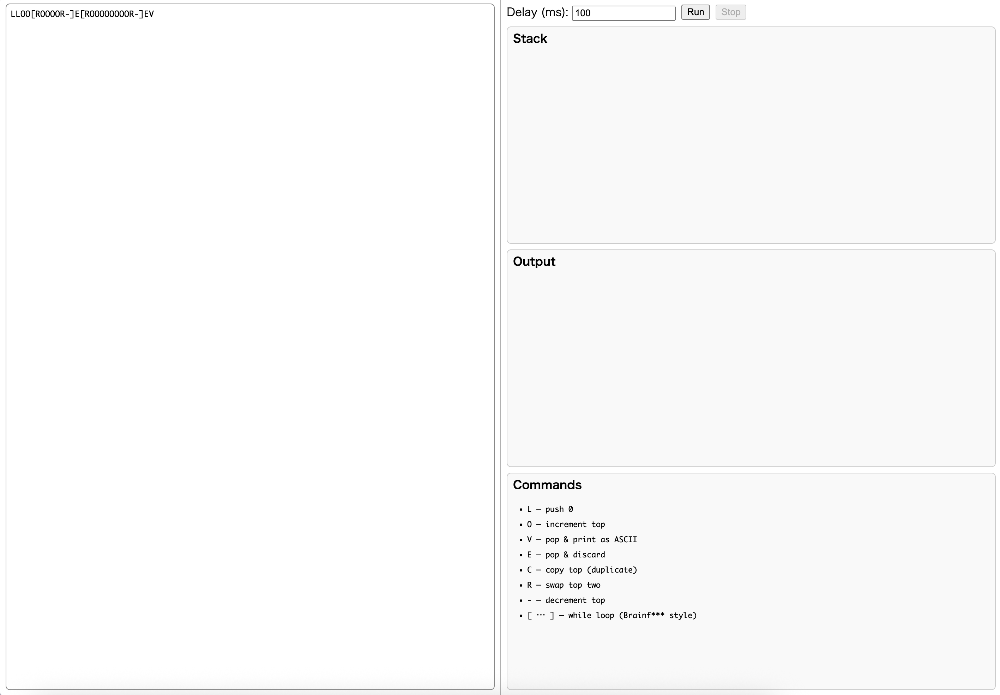

# LOVEStackInterpreter

<!-- # Short Description -->

LOVE Stack Interpreterは、独自のスタックベースのプログラミング言語「LOVE」を実行するためのインタプリタです。このプロジェクトには、Pythonで実装されたコアインタプリタと、ブラウザ上でインタラクティブにLOVEプログラムを実行・視覚化できるHTML/JavaScriptベースのフロントエンドが含まれています。

<!-- # Badges -->

[](https://github.com/Accord33/LOVEStackInterpreter/issues)
[](https://github.com/Accord33/LOVEStackInterpreter/network/members)
[](https://github.com/Accord33/LOVEStackInterpreter/stargazers)
[](https://github.com/Accord33/LOVEStackInterpreter/)
[](https://github.com/Accord33/LOVEStackInterpreter/)

# Demo



# Advantages

*   **独自のプログラミング言語「LOVE」:** 8つのシンプルな命令（`L`, `O`, `V`, `E`, `C`, `R`, `-`, `[`, `]`）で構成される、ユニークなスタックベース言語です。
*   **インタラクティブなWeb実行環境:** HTML/JavaScriptで構築されたフロントエンドにより、ブラウザ上でLOVEプログラムを記述し、実行ステップを視覚的に確認できます。
    *   スタックの状態をリアルタイムで表示
    *   実行速度の調整（遅延設定）
    *   ステップごとの実行制御（Run/Stop）
*   **Pythonインタプリタ:** コアとなるインタプリタロジックはPythonで実装されており、コマンドラインからも実行可能です。
*   **学習・教育目的:** スタックベース言語の動作原理やインタプリタの仕組みを学ぶための教材としても適しています。

# Installation

### 1. Webページ (推奨)
最も簡単でインタラクティブな方法です。
1. [lovestackinterpreter.accord33.org](lovestackinterpreter.accord33.org)へアクセスをします。
2.  左側のテキストエリアにLOVEプログラムを入力します。
3.  必要に応じて「Delay (ms)」で実行ステップ間の遅延時間（ミリ秒）を設定します。
4.  「Run」ボタンをクリックして実行を開始します。
5.  右側の「Stack」領域でスタックの状態の変化、「Output」領域で `V` 命令による出力結果を確認できます。
6.  「Stop」ボタンで実行を中断できます。

**サンプルプログラム:**

```
LLOO[ROOOOR-]E[ROOOOOOOOR-]EV
```

これはASCIIコード 72 ('H') と 105 ('i') を出力します。

### 2. Pythonインタプリタ

コマンドラインから直接インタプリタを実行することも可能です。

1.  ターミナルを開き、`python` ディレクトリに移動します。
2.  `main.py` を実行します。
    ```bash
    python main.py
    ```
3.  `main.py` 内の `prg` 変数に書かれたLOVEプログラムが実行され、`V` 命令による出力がターミナルに表示されます。デバッグモード (`DEBUG = True`) では、各ステップのスタック状態も表示されます。

# Grammar

LOVE言語はスタックマシンとして動作します。スタック上のデータを操作する8つの命令があります。

| 命令 | 説明                                                                 |
| :--- | :------------------------------------------------------------------- |
| `L`  | スタックに `0` をプッシュします。                                      |
| `O`  | スタックの一番上の要素をインクリメント（+1）します。                   |
| `V`  | スタックの一番上の要素をポップし、そのASCIIコードに対応する文字を出力します。 |
| `E`  | スタックの一番上の要素をポップして破棄します。                         |
| `C`  | スタックの一番上の要素を複製してプッシュします。                       |
| `R`  | スタックの上から2つの要素の位置を入れ替えます。                        |
| `-`  | スタックの一番上の要素をデクリメント（-1）します。                   |
| `[`  | スタックの一番上の要素が `0` の場合、対応する `]` までジャンプします。   |
| `]`  | スタックの一番上の要素が `0` でない場合、対応する `[` までジャンプします。 |

*(スペース、タブ、改行は無視されます)*

# Contributors

- [Accord33](https://github.com/Accord33)

<!-- CREATED_BY_LEADYOU_README_GENERATOR -->